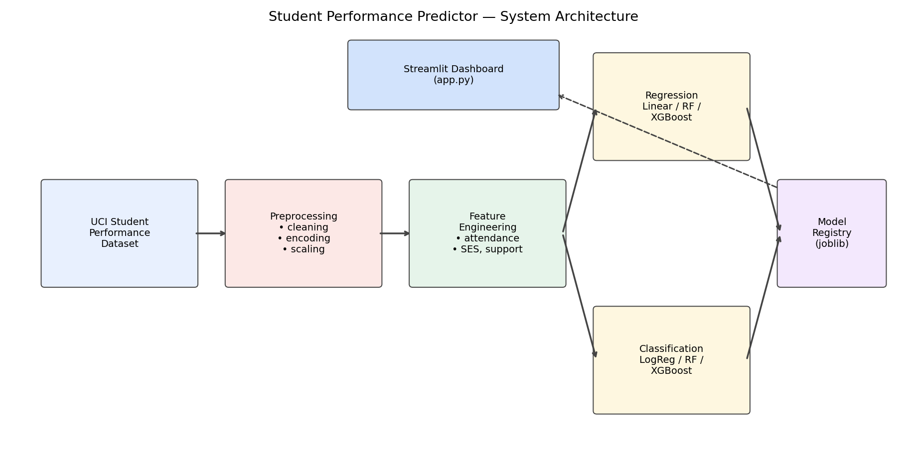
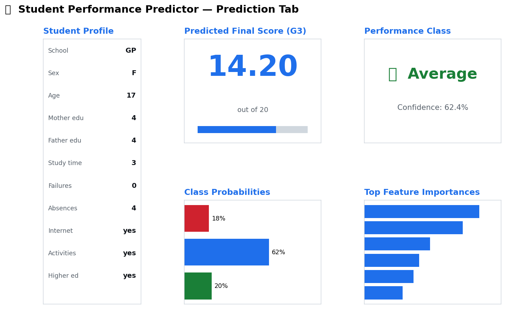
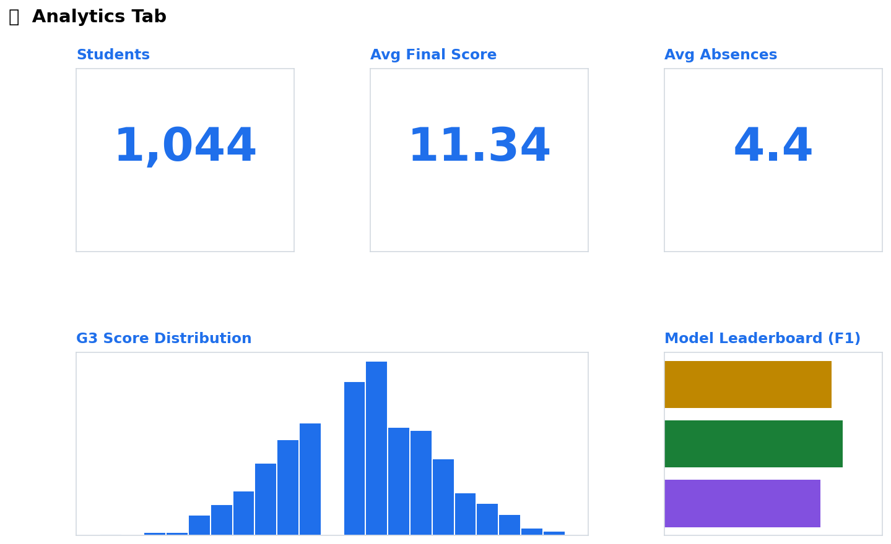
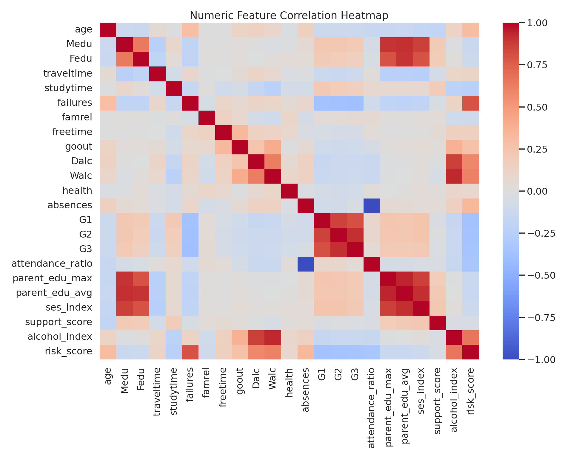
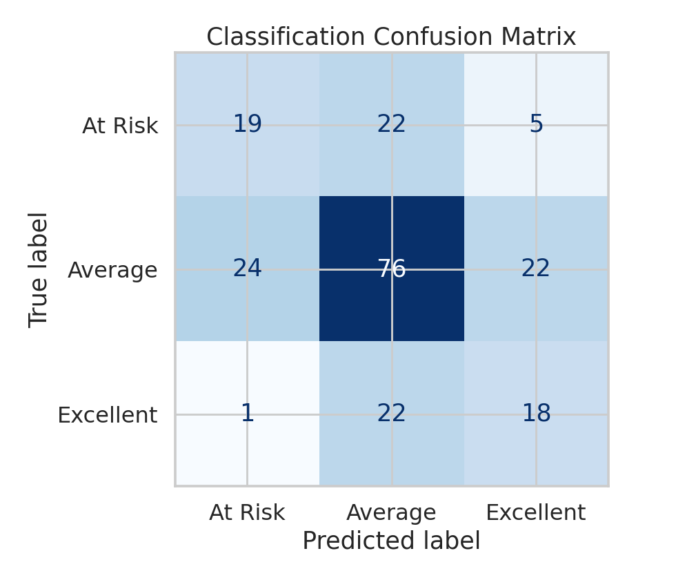
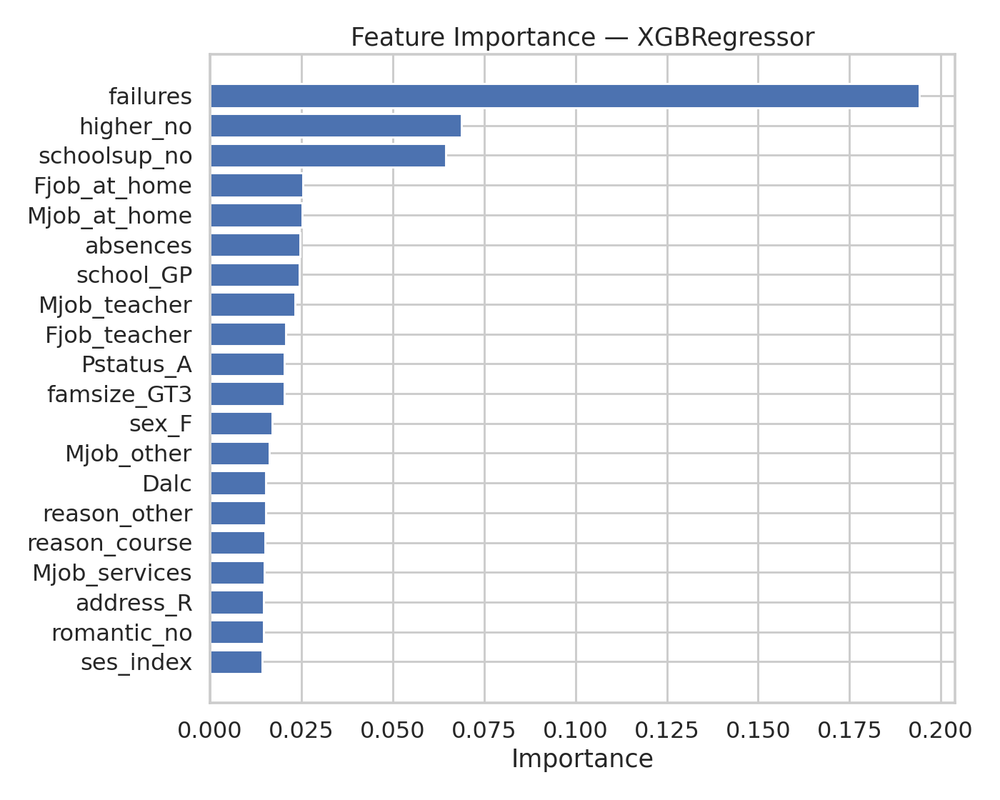
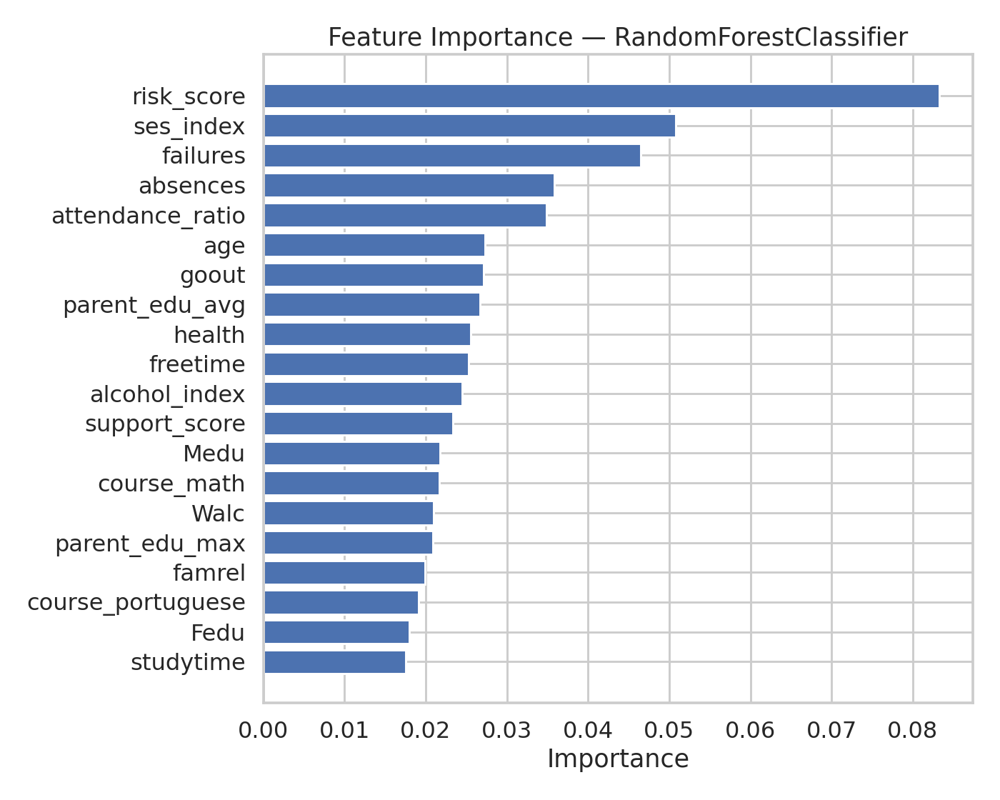
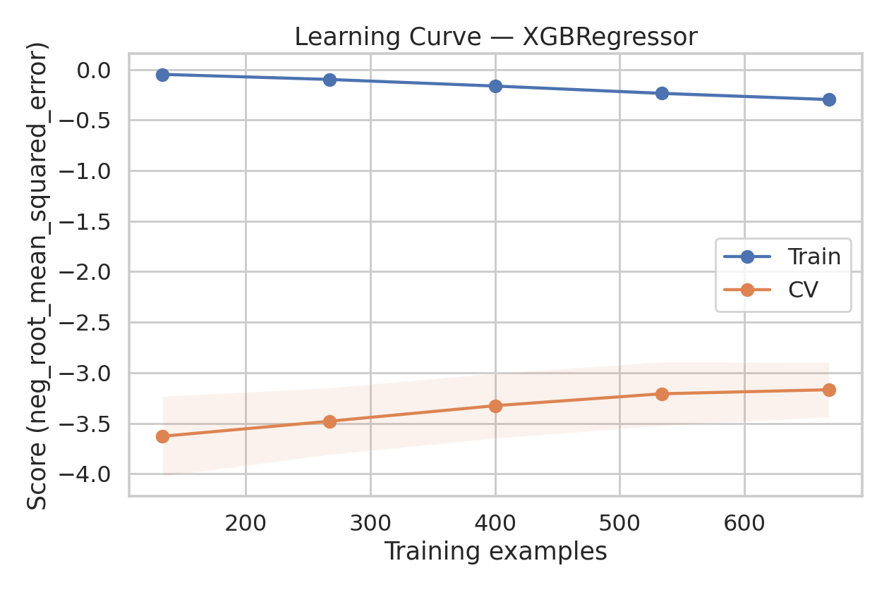
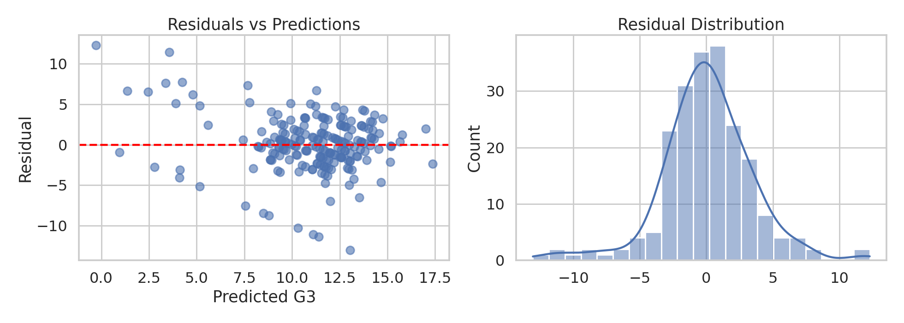

# 🎓 Student Performance Predictor — Regression & Classification ML System

A production-style end-to-end machine learning project that predicts student academic performance from demographic, attendance, study-habit, and socio-economic features. Built on the UCI Student Performance dataset (Cortez & Silva, 2008), with scikit-learn + XGBoost models, GridSearchCV tuning, full diagnostics, and a Streamlit dashboard.

> Built as a portfolio piece for ML Summer School / applied-scientist applications.

---

## 🧭 Architecture



```
UCI Dataset → Preprocessing → Feature Engineering → Train (Regression + Classification)
                                                  → Model Registry (joblib)
                                                  → Streamlit Dashboard
```

---

## 📊 Results (test split, leakage-free — G1/G2 dropped)

### Regression — target `G3` (0–20)

| Model                  | MAE   | RMSE  | R²    |
|------------------------|-------|-------|-------|
| Linear Regression      | 2.605 | 3.670 | 0.129 |
| Random Forest          | 2.532 | 3.498 | 0.209 |
| **XGBoost (best)**     | **2.453** | **3.435** | **0.237** |

### Classification — `At Risk` / `Average` / `Excellent`

| Model                  | Accuracy | Precision (macro) | Recall (macro) | F1 (macro) |
|------------------------|----------|-------------------|----------------|------------|
| Logistic Regression    | 0.435    | 0.439             | 0.486          | 0.431      |
| **Random Forest (best)** | **0.541** | **0.488**       | **0.492**      | **0.490**  |
| XGBoost                | 0.560    | 0.494             | 0.453          | 0.465      |

> Random Forest wins on macro-F1 (the imbalance-aware metric we optimize for), while XGBoost has higher raw accuracy.

Auto-generated detailed metrics live in `models/regression_metrics.json` and `models/classification_metrics.json`.

---

## 🖼️ Dashboard Screenshots

> Mock screenshots rendered with matplotlib for the README. Replace with live captures after running `streamlit run app.py`.




### Diagnostic plots

| Correlation heatmap | Confusion matrix |
|---|---|
|  |  |

| Feature importance (regression) | Feature importance (classification) |
|---|---|
|  |  |

| Learning curve (reg) | Residual analysis |
|---|---|
|  |  |

---

## 🗂️ Project Structure

```
student-performance-predictor/
├── data/
│   ├── raw/                  # UCI CSVs (auto-downloaded)
│   └── processed/            # engineered parquet
├── notebooks/                # EDA / FE / modeling notebooks
├── src/
│   ├── config.py             # paths, RNG, class bins
│   ├── data_loader.py        # download + load UCI
│   ├── preprocessing.py      # cleaning, encoding, scaling, splits
│   ├── feature_engineering.py
│   ├── train_regression.py
│   ├── train_classification.py
│   ├── evaluate.py
│   ├── predict.py            # CLI / app inference
│   └── visualize.py
├── scripts/make_diagrams.py  # architecture + mock screenshots
├── models/                   # serialized .joblib + metrics.json
├── reports/
│   ├── architecture.png
│   └── figures/              # heatmap, importance, curves, residuals, screenshots/
├── app.py                    # Streamlit dashboard
├── requirements.txt
├── README.md
└── .gitignore
```

---

## 🔧 Feature Engineering

Domain-driven features built on top of the raw UCI columns:

| Feature             | Definition |
|---------------------|------------|
| `attendance_ratio`  | `1 - absences / max_absences` |
| `study_hours_group` | UCI `studytime` mapped to Low/Med/High/Very High |
| `parent_edu_max`    | `max(Medu, Fedu)` |
| `parent_edu_avg`    | mean of mother/father education |
| `ses_index`         | weighted blend of parent edu + parent jobs + internet + family size + cohabitation |
| `support_score`     | school + family + paid tutoring + extracurriculars |
| `alcohol_index`     | mean of weekday/weekend alcohol use |
| `risk_score`        | failures + alcohol + low attendance |

To prevent label leakage, `G1` and `G2` (prior-period grades) are dropped by default (toggle `DROP_LEAKAGE_FEATURES` in `src/config.py`).

---

## 🤖 Models & Optimization

- **Regression**: `LinearRegression`, `RandomForestRegressor`, `XGBRegressor`
- **Classification**: `LogisticRegression`, `RandomForestClassifier`, `XGBClassifier`
- **Tuning**: `GridSearchCV` over depth / estimators / learning rate / regularization
- **CV**: 5-fold `KFold` (regression) and `StratifiedKFold` (classification)
- **Scoring**: `neg_root_mean_squared_error` and `f1_macro`
- **Class balance**: `class_weight="balanced"` on linear/forest classifiers

The best estimator per task is persisted to `models/best_regressor.joblib` and `models/best_classifier.joblib` along with the label map and tuned hyperparameters.

---

## 🚀 Quick Start

### 1. Setup

```bash
git clone <your-repo-url>
cd student-performance-predictor
python -m venv .venv && source .venv/bin/activate
pip install -r requirements.txt
```

### 2. Train

```bash
# Dataset is auto-downloaded from UCI on first run
PYTHONPATH=. python -m src.train_regression
PYTHONPATH=. python -m src.train_classification
```

### 3. Predict from the CLI

```bash
PYTHONPATH=. python -m src.predict
```

### 4. Launch the dashboard

```bash
streamlit run app.py
```

Open <http://localhost:8501> and fill in the student profile in the sidebar to get live predictions, confidence scores, and analytics.

---

## ☁️ Deployment

### Streamlit Community Cloud

1. Push this repo to GitHub.
2. Go to <https://share.streamlit.io/> → **New app** → select repo and `app.py`.
3. Set Python version to 3.11+ and let it install `requirements.txt`.
4. App build runs `train_*.py` only if you wire a `prepare.sh`; the recommended flow is to commit the trained `models/` artifacts and let the app load them at startup.

### Docker

```dockerfile
FROM python:3.11-slim
WORKDIR /app
COPY requirements.txt .
RUN pip install --no-cache-dir -r requirements.txt
COPY . .
RUN PYTHONPATH=. python -m src.train_regression && \
    PYTHONPATH=. python -m src.train_classification
EXPOSE 8501
CMD ["streamlit", "run", "app.py", "--server.address=0.0.0.0"]
```

```bash
docker build -t spp . && docker run -p 8501:8501 spp
```

---

## 📈 Evaluation

- **Regression**: MAE, RMSE, R²; residual plot; prediction-vs-actual KDE; learning curve.
- **Classification**: Accuracy, macro-Precision/Recall/F1; confusion matrix; learning curve.
- Metrics are written to `models/*_metrics.json` and rendered in the dashboard's Analytics tab.

---

## 🧪 What's next

- Calibrate classifier probabilities (Platt / isotonic) for sharper confidence bars
- Stacking ensemble across the three classifiers
- SHAP explanations per prediction in the dashboard
- Bias audit by sex / school / address

---

## 🙏 Credits

- **Dataset**: P. Cortez and A. Silva. *Using Data Mining to Predict Secondary School Student Performance.* In A. Brito and J. Teixeira Eds., Proceedings of 5th FUture BUsiness TEChnology Conference (FUBUTEC 2008), pp. 5-12, Porto, Portugal, April 2008. ([UCI ML Repo](https://archive.ics.uci.edu/dataset/320/student+performance))
- Stack: Python · pandas · NumPy · scikit-learn · XGBoost · matplotlib · seaborn · Streamlit · joblib
